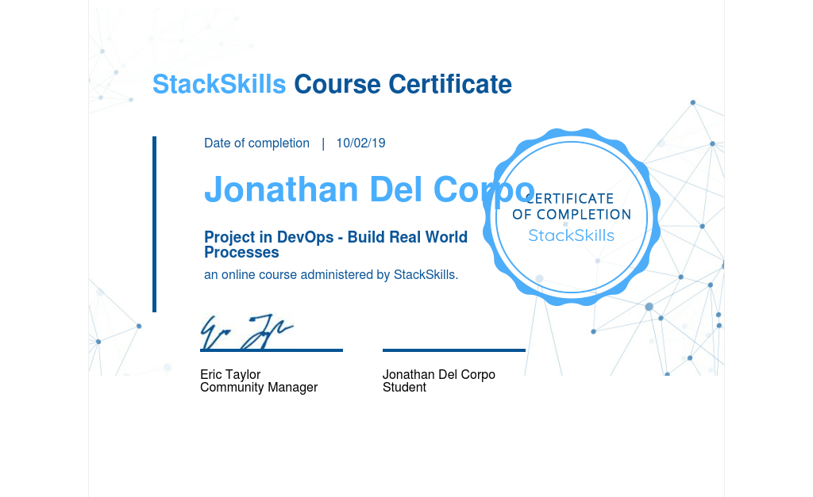

# DevOps

A repository containing notes to DevOps lessons.

These notes provide a brief introduction to
commonly used DevOps tools.

List of my Notes:

- [Vagrant Notes](./Vagrant/Vagrant%20Notes.md)
- [Docker Notes](./Docker/Docker%20Notes.md)
- [Ansible Notes](./Ansible/Ansible%20Notes.md)
- [Git Notes](./Git/Git%20Notes.md)
- [Jenkins Notes](./Jenkins/Jenkins%20Notes.md)
- [Project Notes](./Project/Project%20Notes.md)

